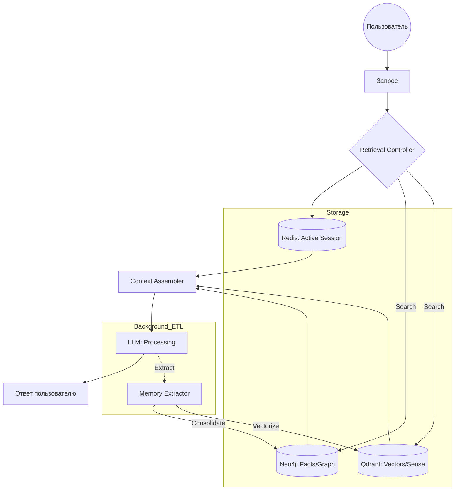

> [!CAUTION]
> Создано Manus/Gemini без верификации. Концептуально хороший файл, связывает теорию Google с архитектурой проекта. Код требует верификации.

# Реализация: Temporal GraphRAG в «Интерпретации»

Мы завершаем наш справочник практической схемой того, как 71 страница теории Google превращается в работающий программный стек проекта «Интерпретация».

## 1. Стек Памяти
- **Short-term (Working)**: Python `ContextManager` в оперативной памяти + Redis.
- **Long-term (Structural)**: Neo4j (Связи, Факты, Хронология).
- **Long-term (Semantic)**: Qdrant (Эмоции, Описания, Смыслы).

## 2. Схема работы (The Memory Loop)

## 3. Временной Граф (Temporal Graph) в Neo4j
Мы не просто храним факты, мы храним их **изменения**. Каждое отношение имеет свойства `start_date` и `end_date`. Это позволяет агенту понимать:
- "Иван был женат на Марии с 1990 по 2005".
- "Сейчас (2026) Иван живет один".

## 4. Эмоциональные векторы в Qdrant
Каждый фрагмент памяти в Qdrant снабжается метаданными:
- `sentiment`: -1.0 to 1.0
- `intensity`: 0 to 10
- `associated_entities`: [list of IDs from Neo4j]

Это позволяет сделать запрос: "Найди самое грустное воспоминание, связанное с Иваном в 2005 году", объединяя мощь обеих баз.

## 5. Итог: Что получает "Ultimate" Агент
Благодаря Context Engineering наш персонаж:
1.  **Не галлюцинирует** о прошлом (проверено по Neo4j).
2.  **Чувствует контекст** и настроение (проверено по Qdrant).
3.  **Не "раздувается"** до бесконечности (благодаря Compaction).

---
*Документация завершена. Это фундамент для реализации самого умного AI-персонажа.*
